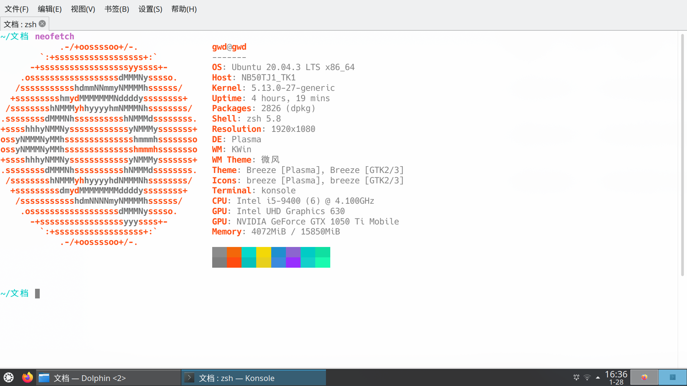
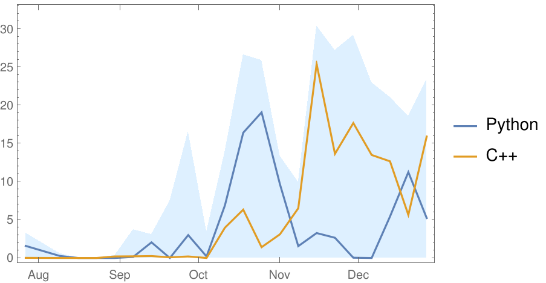
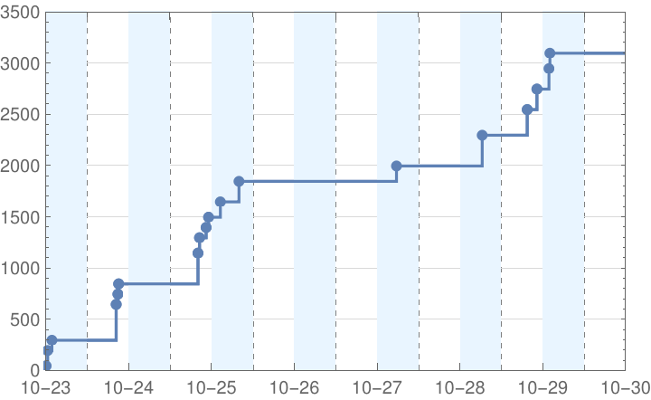
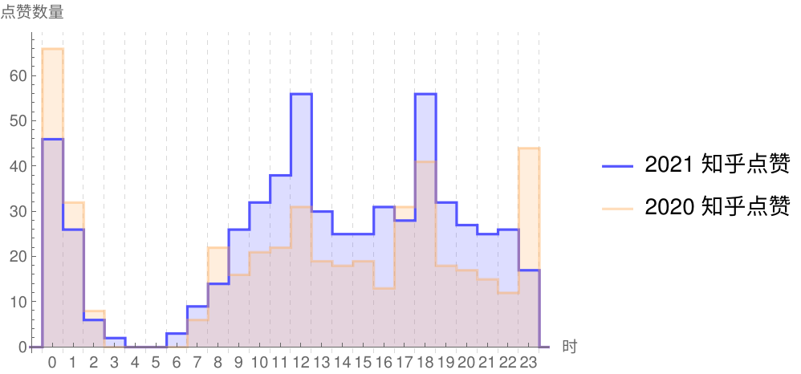
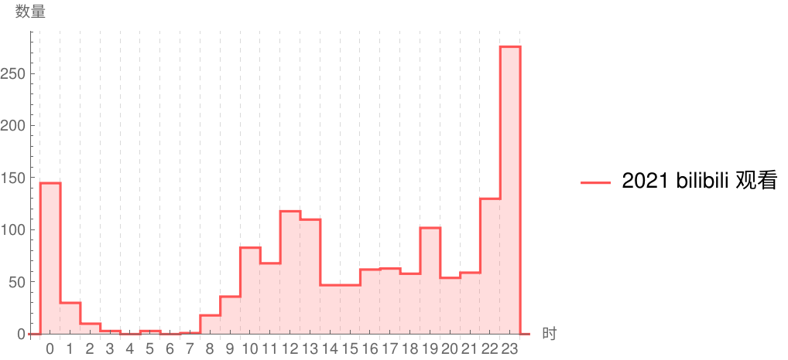

# 
2021 回顾

by GWDx

---

## 1 课程学习

### 大二下

| 课程                 | 描述                                                       |
| -------------------- | ---------------------------------------------------------- |
| 数理方程B            | 作业题计算量大，且大多数 不能直接用 Mathematica       |
| 计算机 组成原理 | 考试几乎都是文字题                                         |
| 操作系统             | 学习 STFW、调试                                            |
| 程序设计II           | 要求将 Markdown 转换为 HTML， 了解正则表达式、tkinter |

### 大三上

| 课程                     | 描述                            |
| ------------------------ | ------------------------------- |
| 编译原理 与技术     | 第一次使用 Gitlab, issue 和分支 |
| 网络安全 基础及应用 | 第一次用 IDA 逆向               |
| 计算机网络               | 抓包并回答问题的实验用处不大    |

---

## 2 技术

### 2.1 使用

| 时间 | 事件                                                         |
| :--- | :----------------------------------------------------------- |
| 1-13 | 用 Pr 剪辑视频                                               |
| 1-19 | 听说 QQ 扫描浏览器历史， 尝试 Sandboxie、VirtualBox， 尽量使用开源软件 |

#### 媒体

| 软件名称 | 描述           |
| -------------- | ------------ |
| GIMP     | 图像处理       |
| kdenlive | 视频处理       |
| **VLC**  | 视频、音频播放 |

#### 工具

| 软件名称                   | 描述            |
| -------------------------- | --------------- |
| **Thunderbird**, FairEmail | 邮件            |
| Motrix                     | BitTorrent 下载 |
| GitHub Desktop             | Git 仓库管理    |

---

| 时间 | 事件                   |
| :--- | :--------------------- |
| 8-26 | 安装 **Kubuntu** 20.04 |

 

#### Linux 下的软件

| 软件名称 | 描述                                                         |
| -------- | ------------------------------------------------------------ |
| fcitx5   | 输入法                                                       |
| **zsh**  | z-shell，有 `zsh-autosuggestions`,  `zsh-syntax-highlighting` 等插件 |

当前窗口截图

---

### 2.2 实践

#### 统计数据

 

2021 年 GitHub 统计数据

2021 年 8-12 月每周的代码时长

| 语言   | 总时长/h |
| :----- | :------: |
| Python |   125    |
| C++    |   126    |
| 总计   |   312    |

> 数据来源：WakaTime 记录的 VSCode 使用时长

---

| 建立时间 | 仓库名称                                                     | 说明                                          |
| -------- | ------------------------------------------------------------ | --------------------------------------------- |
| 1-13     | [2020review](https://github.com/GWDx/2020review)             | 2020 总结                                     |
| 3-7      | [Jog-Every-Day](https://github.com/GWDx/Jog-Every-Day)       | 跑步记录                                      |
| 3-25     | [**Mado**](https://github.com/GWDx/Mado)                     | 可执行 Python, Mathematica 等代码的 QQ 机器人 |
| 3-28     | [GWDx](https://github.com/GWDx/GWDx)                         | 个人 GitHub 主页                              |
| 5-19     | [Course](https://github.com/GWDx/Course)                     | 各门课程的实验                                |
| 5-21     | [Markdown-Interpreter](https://github.com/GWDx/Markdown-Interpreter) | 程序设计 II 大作业——Markdown 转 HTML          |
| 9-12     | [**bilibili-API-collect**](https://github.com/GWDx/bilibili-API-collect) | bilibili API 收集整理（forked）               |
| 9-19     | [Books](https://github.com/GWDx/Books)                       | 读书心得                                      |
| 10-3     | [Script](https://github.com/GWDx/Script)                     | 自用的一些脚本                                |
| 10-31    | [**hackergame2021-writeups**](https://github.com/GWDx/hackergame2021-writeups) | Hackergame2021 题解（forked）                 |
| 12-7     | [GWDx.github.io](https://github.com/GWDx/GWDx.github.io)     | 个人网页                                      |
| 12-23    | [LLVM_for_cpu0](https://github.com/GWDx/LLVM_for_cpu0)       | LLVM 后端学习（forked）                       |

---

#### Mado

> 基于 mirai, Graia 的 QQ 机器人，可执行 Python, Mathematica, C++ 代码

3-19 至 3-27，配置环境、写代码并测试、部署

---

#### 第一次 Pull Request

9-12，找一条弹幕的信息时，发现 [bilibili-API-collect](https://github.com/SocialSisterYi/bilibili-API-collect) 中的一个接口的值有变化

#### Hackergame 2021

> 10-23 至 10-30，第八届中科大信息安全大赛

分数随时间的变化图

题目“Micro World”结果演示

---

### 3 娱乐及生活

#### 动画

| 结束时间 |             动画             |
| :------: | :--------------------------: |
|   7 月   |      **四叠半神话大系**      |
|   8 月   | **EVA 及旧剧场版**、春宵苦短 |
|   9 月   |        魔法纪录第二季        |
|  10 月   |         EVA 新剧场版         |
|  12 月   |        别对映像研出手        |

#### 游戏

发现 HTML 注入的漏洞

---

#### 书

| 时间 |     书名     |
| :--: | :----------: |
| 1 月 | 朝闻道、诗云 |
| 2 月 |  **会饮篇**  |
| 5 月 |  ~~浮士德~~  |
| 6 月 |  **小王子**  |
| 9 月 |   斐德若篇   |

《浮士德》中“善良人在追求中纵然迷惘，却终将意识到有一条正途”让我联想到了大数定律：

> 对于一列独立同分布的随机变量 $\{X_n\}$，若期望有限，则样本均值以概率 1 收敛到期望，即 $\bar{X}\to EX,\ a.s.$

善良人期望为正（ $EX>0$ ），他们在追求中难免会迷惘、会犯错，然而当 $n\to\infty$ 时，终将（以概率 1）寻找到一条正途（ $\bar{X}>0$ ）

---

#### 时间

 

> 以视频的结束时间计

---

## 期待

+ 关注健康
+ 确定发展方向
+ 提高代码能力

 

## 感谢

+ [marp](https://marp.app)
+ [kdenlive](https://kdenlive.org)
+ [captura](https://github.com/MathewSachin/Captura)
